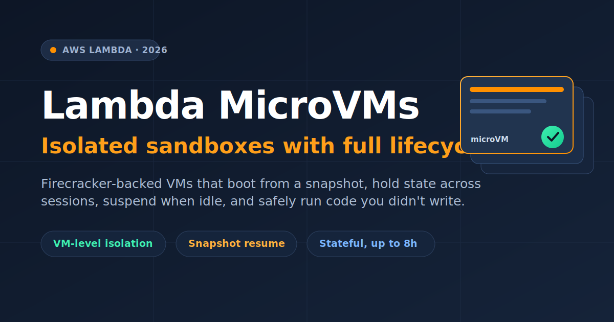
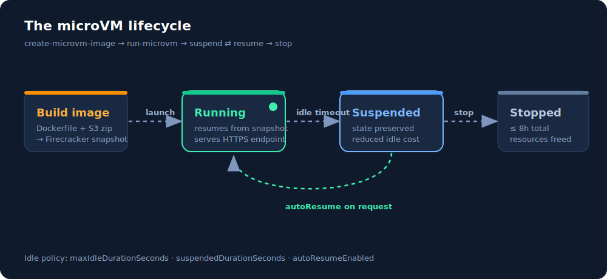
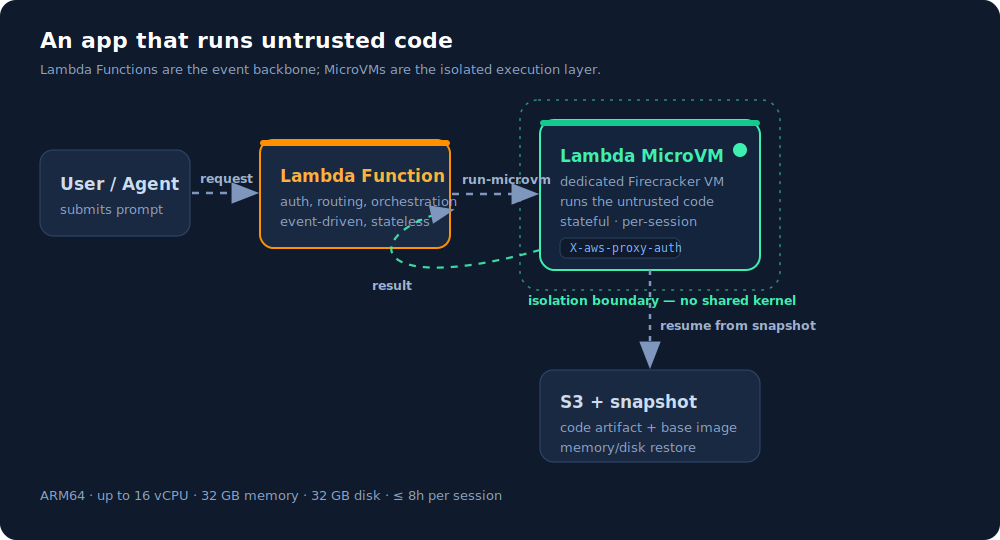

If you've ever tried to run code you didn't write — a snippet an AI agent generated, a script a user pasted into your product, an untrusted plugin — you've run straight into the same wall everyone does. The thing that's good at isolation is slow to start, and the thing that's fast to start is bad at isolation. AWS just shipped a primitive that's aimed squarely at that wall: **Lambda MicroVMs**.

This post is a walkthrough of what they are, the lifecycle model that makes them interesting, and how you'd actually wire one up — with the API calls, a real Dockerfile, and the gotchas that come with a snapshot-based execution model.

## The problem: isolation *or* speed, pick one

For untrusted code there have historically been three options, and each one forces a bad trade-off:

- **Full VMs** give you a hard isolation boundary — no shared kernel, nothing to escape into — but they take minutes to boot. Useless for an interactive "run this and show me the output" loop.
- **Containers** launch in seconds but share the host kernel. To run genuinely untrusted code in one safely, you end up bolting on seccomp, gVisor, user namespaces, and a pile of hardening you have to keep correct forever.
- **Functions-as-a-Service** (regular Lambda) start fast and isolate well, but they're built for short, stateless, request/response work. There's no notion of a long-lived interactive session that keeps its memory and disk between calls.

The new wave of products — AI coding assistants, code interpreters, data-analysis sandboxes, vulnerability scanners — needs all three properties at once: strong isolation, fast start, and *retained state* across a session. That combination is exactly what didn't exist.

MicroVMs are AWS's answer. They're built on [Firecracker](https://firecracker-microvm.github.io/), the same virtualization tech that already runs 15+ trillion Lambda invocations a month, but exposed as a stateful, full-lifecycle compute resource instead of a stateless function.

## The mental model: it's a VM, but it resumes from a snapshot

The key insight is how a MicroVM *starts*. You don't boot it cold every time. Instead:

1. You package your app as a Dockerfile plus a code artifact in S3.
2. Lambda builds the image, **runs your app once, and captures a Firecracker snapshot** of the live memory and disk.
3. Every subsequent launch *resumes from that snapshot* — installed packages, loaded ML models, warmed caches, and working files are all already there.

So you get VM-grade isolation with resume times closer to "unpause a process" than "boot an OS." A multi-gigabyte interactive session can come back to life fast enough to feel responsive.

And it's genuinely stateful. A MicroVM holds memory, disk, and running processes across user requests for **up to 8 hours**. When traffic goes quiet it can **suspend** — freezing state at reduced cost — and **resume** the instant a request arrives.



That suspend ⇄ resume loop is the whole point. A user's coding session can sit idle for ten minutes while they read the output, cost you almost nothing during the gap, and pick up exactly where it left off — same loaded model, same files — when they hit "run" again.

## How it fits with regular Lambda

MicroVMs don't replace Lambda Functions; they sit next to them. The pattern AWS describes is a clean separation of concerns:

- **Lambda Functions** stay the event-driven backbone — auth, routing, orchestration, the stateless glue.
- **MicroVMs** are the isolated execution layer you *call into* for the one dangerous step: running code you didn't write.

> "The two complement each other. An application using Lambda Functions for its event-driven backbone can call into Lambda MicroVMs for the steps that need to run untrusted code in isolation."



Each session lands in its own dedicated MicroVM with no shared kernel, so even if the code inside is hostile, it's contained to that user's environment.

## Building an image

A MicroVM image starts from an AWS base image and a normal Dockerfile. Here's a minimal Python web app — note it just runs a real server on a port, nothing Lambda-specific:

```dockerfile
FROM public.ecr.aws/lambda/microvms:al2023-minimal
RUN dnf install -y python3 python3-pip && dnf clean all

WORKDIR /app

COPY requirements.txt .
RUN pip install --no-cache-dir -r requirements.txt

COPY app.py .

EXPOSE 5000

CMD ["gunicorn", "--bind", "0.0.0.0:5000", "app:app"]
```

You zip the build context, drop it in S3, and ask Lambda to build it. Lambda pulls the artifact, executes the Dockerfile, initializes your app, and snapshots the running disk and memory:

```bash
aws lambda-microvms create-microvm-image \
  --code-artifact uri=s3://my-bucket/path/to/artifact.zip \
  --name my-sandbox \
  --base-image-arn arn:aws:lambda:us-east-1:aws:microvm-image:al2023-1 \
  --build-role-arn arn:aws:iam::<acct>:role/MicroVMBuildRole
```

Build logs stream to CloudWatch at `/aws/lambda/microvms/<image-name>`, and when it finishes the image shows up with an ARN and a version number.

## Launching and the idle policy

Launching a MicroVM is where the lifecycle config lives. The `--idle-policy` flag is the interesting part — it's how you tell Lambda when to suspend and whether to wake back up automatically:

```bash
aws lambda-microvms run-microvm \
  --image-identifier arn:aws:lambda:<region>:<acct>:microvm-image:my-sandbox \
  --execution-role-arn arn:aws:iam::<acct>:role/MicroVMExecutionRole \
  --idle-policy '{
    "maxIdleDurationSeconds": 900,
    "suspendedDurationSeconds": 300,
    "autoResumeEnabled": true
  }'
```

Reading that policy out loud: after **900 seconds (15 min)** with no requests, suspend the VM; keep it suspended for up to **300 seconds**; and if a request arrives while suspended, **automatically resume** it. Tune these to your workload — a quick vulnerability scan that runs for minutes wants a short idle window, while an interactive coding session a user keeps coming back to wants a generous one.

## Talking to it

Once running, Lambda assigns the MicroVM a unique ID and a **dedicated HTTPS endpoint URL** — no VPC, no load balancer, no networking setup. You just make plain HTTPS requests, attaching a short-lived auth token in the `X-aws-proxy-auth` header:

```bash
curl https://<microvm-id>.microvm.lambda.<region>.amazonaws.com/run \
  -H "X-aws-proxy-auth: <short-lived-token>" \
  -H "Content-Type: application/json" \
  -d '{"code": "print(sum(range(100)))"}'
```

Because each MicroVM is its own endpoint, routing a given user's session to a warm, stateful VM is just "send the request to that VM's URL."

## The specs, plainly

| Property | Limit |
| --- | --- |
| Architecture | ARM64 only |
| vCPUs | up to 16 |
| Memory | up to 32 GB |
| Disk | up to 32 GB |
| Max runtime | 8 hours per MicroVM |

Available at launch in **US East (N. Virginia, Ohio)**, **US West (Oregon)**, **Europe (Ireland)**, and **Asia Pacific (Tokyo)**. Suspended MicroVMs bill at a reduced idle rate; check the Lambda pricing page for the active numbers.

## The one gotcha: snapshots and non-determinism

The resume-from-snapshot model is the source of all the speed, and also the source of the only real footgun. Because Lambda captures a *single* snapshot of one initialized run and replays it for every launch, anything your app baked in during init is now frozen and shared.

AWS calls this out directly: apps that **generate unique content, open network connections, or load ephemeral data during initialization** may need to integrate with service-provided hooks for snapshot compatibility. Concretely, that means:

- Don't seed a PRNG or generate UUIDs at init — every resumed VM would replay the same seed. Defer that to per-request code, or re-seed on resume.
- Don't hold a long-lived DB/socket connection open across the snapshot — it'll be stale on resume. Reconnect when the VM wakes.
- Anything time- or entropy-sensitive belongs *after* resume, not before the snapshot.

If you've ever debugged Lambda SnapStart, this is the same class of problem with the same shape of fix: use the resume hook to re-establish anything that can't survive being frozen.

## When to reach for this

MicroVMs earn their keep when you need an isolated, stateful environment per user or per session — and the canonical case is running code you don't trust:

- **AI coding assistants** and **code interpreters** executing model-generated code
- **Data-analytics sandboxes** where users run arbitrary queries or notebooks
- **Vulnerability scanners** and security tooling that detonate untrusted inputs
- **Game servers** running user-supplied scripts

If your workload is short, stateless, and you wrote all the code yourself, a plain Lambda Function is still the right, cheaper tool. MicroVMs are for the specific moment you need a real isolation boundary *and* the session to remember what it was doing.

That combination — VM isolation, snapshot-fast resume, and hours of retained state — is what was genuinely missing from the serverless toolbox, and it's why this is worth a look the next time you find yourself about to hand-roll a container sandbox.
