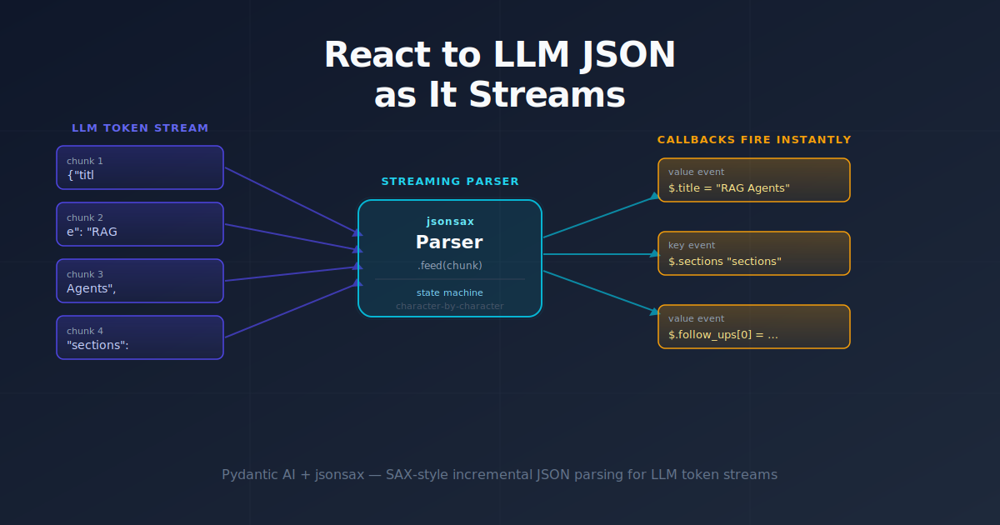

When you ask an LLM to respond with structured JSON, the usual pattern is: wait for the whole response, then parse it. That works — but it throws away everything streaming gives you. If the model is generating a 2,000-word article, you're sitting on your hands until the last `}` arrives before you can show anything.

This PR wires a SAX-style streaming JSON parser ([jsonsax](https://pypi.org/project/jsonsax/)) into a Pydantic AI agent so that fields print the moment they finish arriving — the title appears before the first section has started, and each section renders as it completes.

## The problem

Pydantic AI's `run_stream()` with `output_type=SomeModel` buffers partial structured output and yields increasingly complete snapshots via `stream_output()`. That's great for observing progress, but you still can't *act* on a field until the model has written enough of the document for the partial object to be valid. In practice, `$.title` isn't available until the Pydantic model's required fields all have values — which means waiting for the end.

The `stream_text(delta=True)` API gives us raw token deltas instead. That's the hook we need: raw text arrives in small pieces, and we can feed it into a streaming parser that fires a callback the moment it finishes any JSON value.

## The approach

The core idea is a **SAX-style JSON parser**: instead of building a tree, it fires events (callbacks) for each structural element as it's recognized. This is exactly how XML SAX parsers have worked since the 1990s — same idea, different format.

`jsonsax` is a dependency-free Python library built for this. You feed it text in arbitrary chunks, and it calls your registered handlers:

```python
from jsonsax import Parser

parser = Parser()
parser.on("value", lambda path, val: print(path, "=", val))

for chunk in ['{"titl', 'e": "RAG"', ', "score": 9}']:
    parser.feed(chunk)
parser.close()
# $.title = RAG       ← fires as soon as the string closes
# $.score = 9
```

The alternative would be to try to incrementally deserialize Pydantic models from partial JSON ourselves — brittle, schema-dependent, and reinventing a parser. Using a dedicated streaming parser and keeping the Pydantic model for final validation is a cleaner separation.

## Implementation

### `ArticleStreamPrinter`

The main new class in `streaming.py`. It wraps a `jsonsax.Parser` and has two responsibilities: tolerate the messy reality of LLM output, and route events to the right display logic.

**Tolerating messy LLM output.** Real models sometimes prepend ` ```json\n` or a sentence before the JSON, even when the system prompt says not to. The `feed()` method skips characters until it sees the first `{` or `[`:

```python
def feed(self, text: str) -> None:
    for char in text:
        if self._complete:
            return
        if not self._started:
            if char in "{[":
                self._started = True
            else:
                continue   # skip prose / ``` fences
        self._parser.feed(char)
```

Once the JSON closes (the root `end_object` event fires with `path == "$"`), `_complete` is set to `True` and any trailing junk after the `}` is silently dropped. jsonsax is strict — it would raise `ParseError` on trailing data — so we gate it off before that happens.

**Routing events.** The `_on_value` callback uses JSONPath-style paths that jsonsax provides (e.g. `$.sections[0].title`) to decide what to print:

```python
def _on_value(self, path: str, value: object) -> None:
    if path == "$.title":
        print(f"\n# {value}\n")
    elif path == "$.content":
        print(value)
    elif path.endswith(".title"):       # $.sections[0].title, etc.
        print(f"\n## {value}")
    elif path.endswith(".content"):
        print(value)
    elif path == "$.follow_ups[0]":    # first item: emit heading too
        print("\n## Follow Ups")
        print(f"- {value}")
    elif path.startswith("$.follow_ups["):
        print(f"- {value}")
```

No regex, no schema introspection — just string matching on paths.

### Pydantic schema as a prompt

Because we're using `stream_text()` instead of `output_type=`, the schema enforcement moves to the system prompt:

```python
agent = Agent(
    model,
    system_prompt=(
        "You are an article writer. Respond with ONE JSON object and nothing "
        "else - no markdown, no code fences, no commentary. It must match this "
        "JSON schema:\n" + json.dumps(ArticleResponse.model_json_schema())
    ),
)
```

`ArticleResponse.model_json_schema()` includes the `Field(description=...)` for each field, so `follow_ups` carries its description "Follow-up questions to ask" directly into the prompt. The model sees that description and knows what the field means.

### Final validation

Streaming parse events are best-effort: a dropped connection or hallucinated extra key won't break the loop. After the stream ends, the raw text is validated with Pydantic to get a clean, typed object:

```python
article = ArticleResponse.model_validate_json(_clean_json(raw))
```

`_clean_json` trims anything outside the outermost `{…}` — a simple `find`/`rfind` pair — before Pydantic sees it.

### Data flow


## Results

The PR touches 3 files and adds 160 lines (net). The key deliverable is `structured_output/streaming.py`:

- **Title and intro print first**, while the model is still generating the first section body.
- **Each section header appears** the moment `$.sections[N].title` closes.
- **Follow-up questions render** as a markdown list as each string value arrives.
- If the model wraps its output in a code fence (common with weaker free-tier models), the parser still works — it just skips to the first `{`.

`jsonsax` itself is ~300 lines of pure Python, zero dependencies, and was published to PyPI as part of this work — so the only addition to `pyproject.toml` is a single new dependency.

## What's next

A few known limitations worth addressing:

**Model reliability.** Smaller/free models occasionally emit malformed JSON. The final `model_validate_json` will surface this as a `ValidationError`, but there's no retry logic yet. A simple fallback that re-prompts once on failure would harden this.

**Generic field routing.** The `_on_value` path matching is hardcoded for `ArticleResponse`. A cleaner version would accept a field-to-formatter map at construction time so `ArticleStreamPrinter` can be reused with different schemas.

**Token-level latency.** Right now `feed()` iterates character-by-character through each delta. For large deltas this is fine (Python strings are fast), but feeding multi-character chunks directly to jsonsax (it supports that) would reduce overhead if token deltas grow.

The pattern itself is solid: SAX-style callbacks on a streaming JSON parser, with strict validation as a backstop after the stream closes. It works with any LLM provider that supports `stream_text(delta=True)` — swap OpenRouter for Anthropic or OpenAI and the `ArticleStreamPrinter` stays unchanged.
