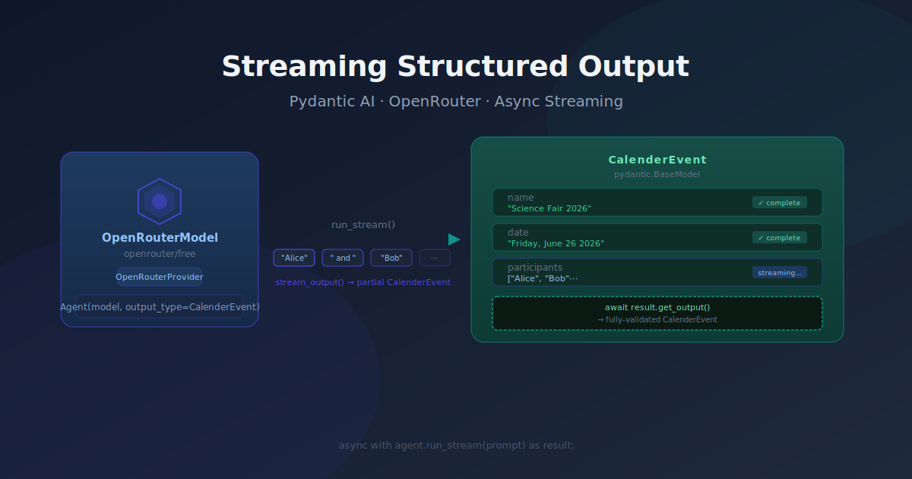
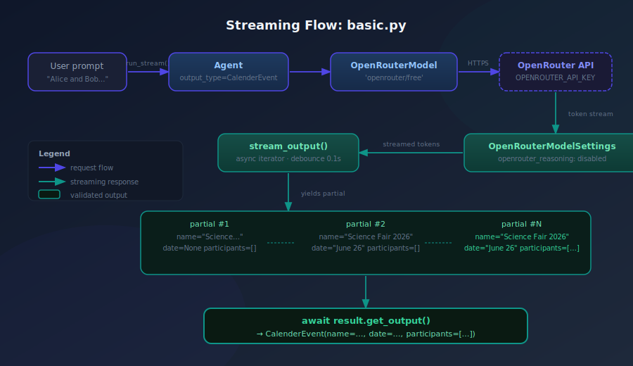

Waiting for a full LLM response before you can do anything with it is fine for short outputs. It gets painful fast when you want to show progress, pipe results downstream, or simply know whether the model is even heading in the right direction. This post walks through wiring `pydantic-ai` to OpenRouter with streaming structured output — so you get a progressively-populated Pydantic model as tokens arrive, not a finished object at the end.

## The problem: all-or-nothing structured output

`run_sync()` blocks until the model finishes generating and pydantic-ai validates the entire response into your output type. That's the right default for scripts and tests, but it leaves two things on the table:

1. **User feedback latency.** If your output is a model with five fields, you could show the first three as soon as they're complete. Instead you wait for field five before you can show anything.
2. **Pipeline composability.** Downstream consumers — a UI, another agent step, a log sink — have to wait for the full object. Streaming lets them act on partial data immediately.

The fix is a one-method swap: `run_stream()` instead of `run_sync()`, plus an async iterator that yields partial model instances.

## The approach: two pydantic-ai primitives

The whole thing rests on two things from `pydantic_ai.models.openrouter` and `pydantic_ai.providers.openrouter`:

**`OpenRouterProvider`** handles authentication and routes to the OpenRouter API. It reads `OPENROUTER_API_KEY` from the environment automatically, so no key wiring in application code beyond a `load_dotenv()` call.

**`OpenRouterModelSettings`** lets you pass provider-level options that pydantic-ai doesn't know about natively — in this case, disabling reasoning tokens so the response doesn't include chain-of-thought noise before the structured output:

```python
settings = OpenRouterModelSettings(
    openrouter_reasoning={"enabled": False},
)
```

Without this, some OpenRouter models emit a `<think>…</think>` block before the JSON, which confuses the partial-validation pass.

## Implementation: the streaming loop

The output type is a plain Pydantic model:

```python
class CalenderEvent(BaseModel):
    name: str
    date: str
    participants: list[str]
```

The agent is configured once at module level:

```python
model = OpenRouterModel(
    "openrouter/free",
    provider=OpenRouterProvider(api_key=openrouter_api_key),
    settings=settings,
)
agent = Agent(model, output_type=CalenderEvent)
```

The interesting part is the async main:

```python
async with agent.run_stream(prompt) as result:
    async for partial in result.stream_output():
        print(partial.model_dump())

print("Final:", (await result.get_output()).model_dump())
```

`run_stream()` opens the streaming context. `stream_output()` is an async iterator that yields `CalenderEvent` instances as fields accumulate — debounced to 100ms by default so you don't flood your loop with nearly-identical partial objects. `get_output()` returns the fully-validated final object after the context closes.

A few things worth noting about `stream_output()`:

- **Partial objects may have `None` fields.** As the model generates JSON incrementally, fields not yet emitted will be absent or `None`. Design any consumer of the partial stream to tolerate this.
- **Validation is real.** Each yielded object has passed through Pydantic's validator for the fields that exist so far — you're not getting raw strings.
- **`stream_text()` is the alternative.** If you only want raw token deltas (for a chat UI, say), `result.stream_text(delta=True)` skips Pydantic entirely and gives you strings.



## What the output looks like

For the prompt `"Alice and Bob are going to a science fair on Friday, June 26 2026."`, the partial stream produces something like:

```
{'name': 'Science Fair 2026', 'date': None, 'participants': []}
{'name': 'Science Fair 2026', 'date': 'Friday, June 26 2026', 'participants': []}
{'name': 'Science Fair 2026', 'date': 'Friday, June 26 2026', 'participants': ['Alice']}
{'name': 'Science Fair 2026', 'date': 'Friday, June 26 2026', 'participants': ['Alice', 'Bob']}
Final: {'name': 'Science Fair 2026', 'date': 'Friday, June 26 2026', 'participants': ['Alice', 'Bob']}
```

Each line is a real `CalenderEvent.model_dump()` — not raw JSON. The `participants` list grows as the model emits each name; `name` and `date` lock in early.

## Impact

One file added (`structured_output/basic.py`, 51 lines). The delta over a `run_sync()` approach is exactly three lines in `main()` — the `async with`, the `async for`, and the `get_output()` call. The rest of the setup — model, provider, settings, output type — is identical.

The pattern composes directly with the existing RAG pipeline: replace `agent.run_sync()` in `rag_search_chunk_llm.py` with `run_stream()` and you get streaming answers over retrieved chunks without changing anything else.

## What's next

A few natural follow-ons:

- **UI integration.** Wire `stream_output()` to a WebSocket or SSE endpoint so a frontend can render fields as they arrive — especially useful when `participants` is a long list.
- **Error handling on partial objects.** If the model stops mid-JSON (network drop, token limit), `get_output()` raises. Wrapping the context manager in a try/except and falling back to the last valid partial is worth adding for production use.
- **Model selection.** `openrouter/free` routes to whichever free model OpenRouter has available. Pinning to a specific model (e.g. `anthropic/claude-haiku-4-5-20251001`) gives deterministic behavior at the cost of a defined budget.
