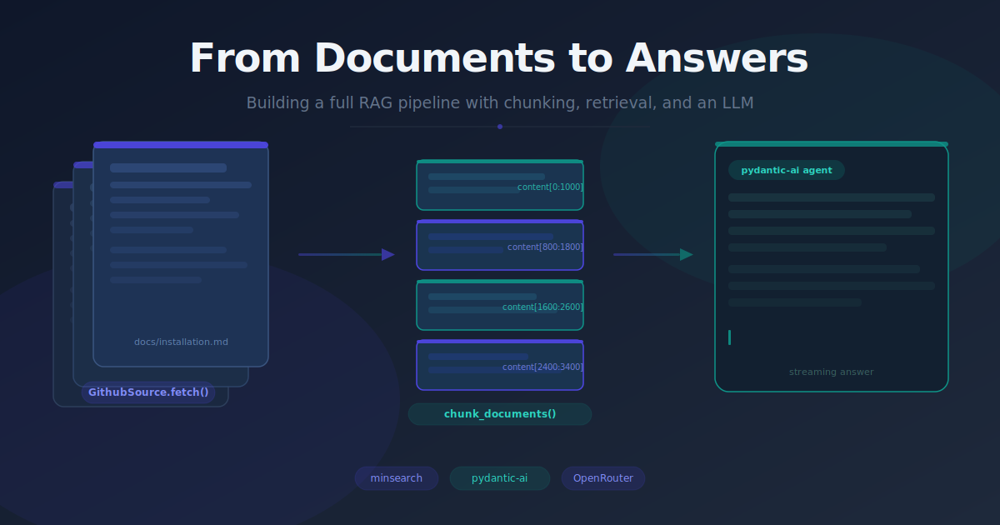
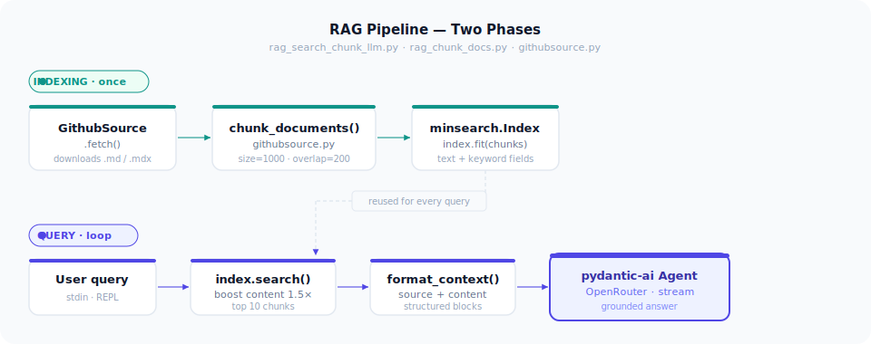

Retrieval, chunking, and generation each get their own tutorials. Wiring them together into something you can actually run against a real repository is where the interesting decisions happen. This post walks through how `chunk_documents()`, a minsearch index, and a pydantic-ai agent connect into one pipeline that answers questions about any GitHub repo's documentation.

## The problem: whole documents make poor context

The project could already search documents — `GithubSource` fetched markdown files from a GitHub repo and `minsearch` scored them against a query. But the unit of retrieval was the entire document. A 4,000-word setup guide came back as a single blob.

That fails in two directions. Fed to an LLM, a long document buries the relevant paragraph in noise and consumes context window budget fast. Shown to a user, it's a wall of text to wade through. Neither is an answer.

The second gap was generation itself. Retrieval existed; synthesis didn't. You could find documents, but nothing composed a reply from them.

## The approach: overlap at the seams, an agent for answers

Two changes: **chunk before indexing**, and add a **pydantic-ai agent for generation**.

Chunking lives on `GithubSource` as a method rather than a separate preprocessor, which keeps the call site clean:

```python
documents = github.fetch()
chunks    = github.chunk_documents(documents)
index     = build_index(chunks)
```

The alternative — a standalone `Chunker` class — would have added a layer of indirection without adding clarity at this stage. The document-loading abstraction already owns everything about how docs are fetched and shaped; chunking is a natural extension of that responsibility.

For generation, pydantic-ai connects to an LLM through OpenRouter. The streaming interface (`agent.run_stream`) shows answers token by token — the right feel when a response takes several seconds. Using the free tier keeps the pipeline zero-cost during iteration.

A vector store with embeddings would catch more semantic similarity, but it adds an embedding model, a vector database, and network latency. minsearch's TF-IDF approach is the correct trade-off here: in-process, zero-infrastructure, and fast enough for interactive use.

## Implementation highlights

### Chunking with overlap

A sliding window with `chunk_size=1000` and `overlap=200` gives an 800-character stride. Without overlap, a sentence that crosses a chunk boundary gets split and scores poorly against any query targeting that sentence. Overlap ensures boundary text lands fully inside at least one chunk.

```python
def chunk_documents(self, documents, chunk_size=1000, overlap=200):
    for doc in documents:
        content = doc["content"]
        for i in range(0, len(content), chunk_size - overlap):
            chunk = content[i : i + chunk_size]
            chunks.append({
                "content": chunk,
                "title": doc["title"],
                "description": doc["description"],
                "file_name": doc["file_name"],
            })
```

Each chunk inherits the parent document's `title`, `description`, and `file_name`. That metadata travels through the index and comes back with search results — how `format_context()` can cite source files in the LLM prompt without a second lookup.

> **Known bug:** The current diff iterates over `range(0, len(doc), ...)` — the dict length (always 4), not the content string — and slices to `1+chunk_size` instead of `i+chunk_size`. So every document currently produces four identical copies of its first 1,000 characters. The fix is `range(0, len(content), chunk_size - overlap)` and `content[i : i+chunk_size]`.

### Text fields vs. keyword fields

```python
index = Index(
    text_fields=["title", "description", "content"],
    keyword_fields=["file_name"],
)
index.fit(chunks)
```

Keeping `file_name` as a keyword field keeps it out of BM25 relevance scoring. It's for exact-match filtering ("only search docs under `docs/reference/`"), not semantic matching. At query time, `boost_dict={"content": 1.5}` nudges the scorer to weight the passage text more than the title, which sharpens precision for prose questions.

### A domain-agnostic system prompt

Instead of hardcoding "you are a documentation assistant for Evidently," the `SYSTEM_PROMPT` tells the agent to answer about "whatever documentation is supplied at runtime." Swap `GITHUB_URL` to a different repo and the agent adapts with no prompt change.

Three behavioral contracts are spelled out explicitly: **grounding** (no claim without supporting context), **self-correction** (infer intent → select relevant passages → reconcile conflicts → re-check draft), and **session learning** (treat corrections as durable signal across turns).

### Attribution for free

```python
def format_context(results):
    blocks = []
    for doc in results:
        blocks.append(
            f"Source: {doc['file_name']}\n"
            f"Title:  {doc['title']}\n"
            f"{doc['content']}"
        )
    return "\n\n---\n\n".join(blocks)
```

Labeling each block with its source file lets the model cite files in its answer — no post-processing. The `---` separators read as section boundaries to most models.

## The pipeline



The index is built once at startup and reused for every query in the session. Building it per question would re-download and re-chunk the whole repo each time — expensive and unnecessary. The query loop is: user input → `index.search()` → `format_context()` → `build_prompt()` → streaming LLM response.

The streaming loop is worth a look:

```python
async with agent.run_stream(prompt) as result:
    async for chunk in result.stream_text(delta=True):
        print(chunk, end="", flush=True)
```

`flush=True` is what keeps the terminal responsive. Without it, the answer buffers and appears all at once after a delay — which feels slow and broken for a long generation.

## What shipped

Three new capabilities from three files: `githubsource.py` gets chunked document splitting, `rag_chunk_docs.py` provides a retrieval-only harness for debugging the index without spending an LLM call, and `rag_search_chunk_llm.py` is the end-to-end demo you can point at any public GitHub repo by changing `GITHUB_URL`.

## What's next

**Fix the chunking loop first.** The stride and slice bugs mean the pipeline runs but produces garbage chunks. Nothing else improves until these two lines are corrected.

**Thread message history.** The query loop discards context between turns. Passing `message_history` into `run_stream()` — already done in `llm.py` — makes the self-learning system prompt behaviorally meaningful for multi-turn sessions.

**Sentence-aware splitting.** Character boundaries cut mid-sentence. Splitting on paragraph breaks (`\n\n`) or sentence endings would produce semantically cleaner chunks and better retrieval precision on prose documentation.

**Persist the index.** Re-fetching and re-chunking the repo on every startup is slow. Serializing the fitted index to disk makes repeat queries near-instant for interactive use.

**Retrieval visibility.** There is no way to know whether the top-10 chunks are the right ones. Logging which files surface per query is the minimum needed to tune `boost_dict` and `num_results` with actual evidence.
