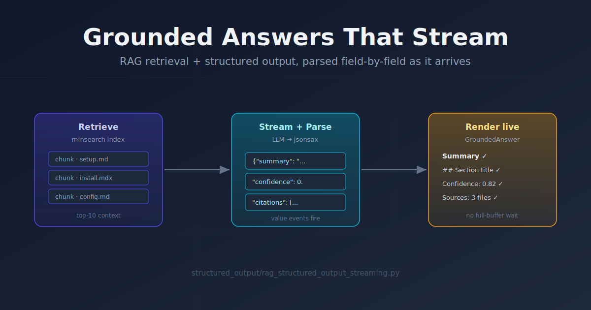
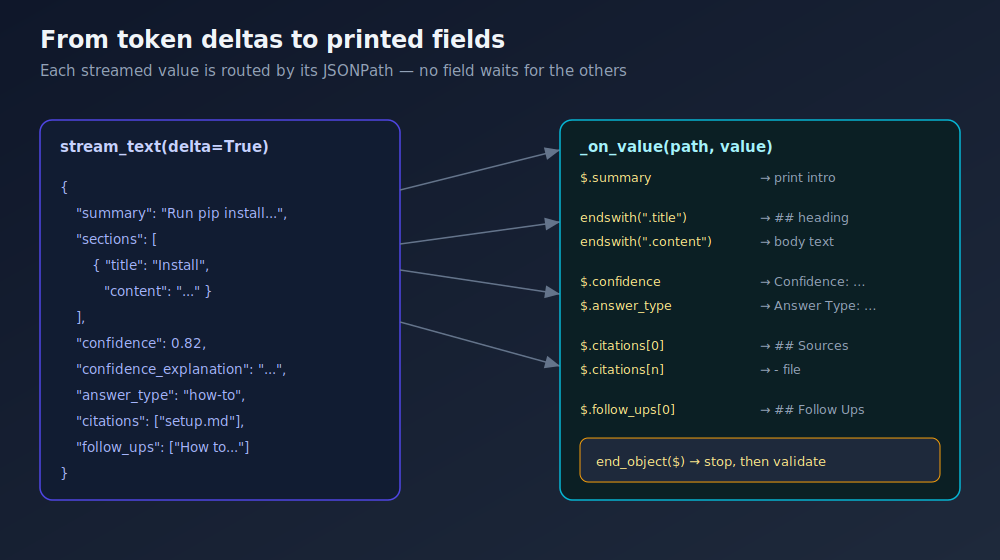

Two earlier posts on this project tackled adjacent problems. One built a [full RAG pipeline](rag-chunking-llm.md) — chunk a repo, index it with minsearch, retrieve the relevant pieces, and let an LLM answer. The other wired [jsonsax into a Pydantic AI agent](llm-streaming-json-jsonsax.md) so a structured JSON response renders field-by-field as it streams, instead of after the final `}`.

This PR is the obvious-in-hindsight merge of the two: a retrieval-augmented agent whose answer is a *rich structured object* — summary, sections, confidence, citations, follow-ups — that streams into view as the model writes it. 238 new lines in one file, `structured_output/rag_structured_output_streaming.py`.

## The problem: grounded answers want structure, structure wants to wait

A plain RAG loop returns prose. That's fine to read, but it's hard to *use*. If you want to show a confidence badge, list the source files separately, or branch on whether this is a how-to vs. a troubleshooting answer, you have to parse intent back out of free text. The clean fix is to ask the model for structured output — a JSON object with named fields.

But structure fights streaming. The moment you hand Pydantic AI an `output_type=GroundedAnswer`, `stream_output()` only yields snapshots once the partial object validates — and with required fields, that's effectively the end of the response. You've traded the whole point of streaming for the convenience of a typed object. On a multi-section answer grounded in ten retrieved chunks, that's a long stare at a blank terminal.

I wanted both: the richness of a schema *and* fields that appear as they land.

## The approach: ask for raw JSON, parse the stream yourself

The trick — carried over from the jsonsax post — is to *not* use `output_type`. Instead the agent is a plain-text agent whose system prompt carries the schema and demands one bare JSON object:

```python
SYSTEM_PROMPT = (
    "You are a precise retrieval-augmented assistant. Answer the user's "
    "question using ONLY the provided context ...\n\n"
    "Respond with ONE JSON object and nothing else ... It must match this "
    "JSON schema:\n" + json.dumps(GroundedAnswer.model_json_schema())
    + "\n\nCite the source file names you used in the 'citations' field."
)

agent = Agent(model, system_prompt=SYSTEM_PROMPT)
```

`model_json_schema()` means the prompt and the validator never drift — the schema is generated from the same Pydantic model that validates the result at the end. The model is told to ground strictly in the retrieved context and to leave sections empty when the context is thin, which keeps it honest rather than hallucinating to fill the structure.

The `GroundedAnswer` model is where the "use it programmatically" payoff lives:

```python
class GroundedAnswer(BaseModel):
    summary: str
    sections: list[AnswerSection]
    confidence: float
    confidence_explanation: str
    answer_type: Literal["how-to", "explanation", "troubleshooting",
                         "comparison", "reference"]
    citations: list[str]
    follow_ups: list[str]
```

The `Literal` on `answer_type` is doing real work: it constrains the model to a closed set the schema enforces, so downstream code can switch on it without defensive string matching. `confidence` + `confidence_explanation` give a self-reported certainty signal you can surface or threshold on.

## Implementation highlights

### Retrieval, reused wholesale

The retrieval half is lifted straight from the existing RAG example — `GithubSource` fetches and chunks a repo, `minsearch` indexes the chunks on `title`/`description`/`content`, and a query pulls the top 10:

```python
results = index.search(query, boost_dict={"content": 1.5}, num_results=NUM_RESULTS)
prompt = build_prompt(query, format_context(results))
```

`format_context()` stitches each hit into a `Source: … / Title: … / content` block so the model can cite by file name. Nothing exotic — the interesting part is what happens to the response.

### Routing each value by its JSONPath

`AnswerStreamPrinter` feeds raw token deltas into a jsonsax `Parser` and registers a single `value` handler. Because jsonsax reports the *path* of every completed value, the handler is just a routing table:



```python
def _on_value(self, path, value):
    if path == "$.summary":
        print(f"\n{value}\n")
    elif path.endswith(".title"):        # $.sections[0].title
        print(f"\n## {value}")
    elif path.endswith(".content"):
        print(value)
    elif path == "$.citations[0]":       # first one prints the heading too
        print("\n## Sources")
        print(f"- {value}")
    elif path.startswith("$.citations["):
        print(f"- {value}")
    elif path == "$.confidence":
        print(f"\nConfidence: {value}")
    elif path == "$.answer_type":
        print(f"Answer Type: {value}")
```

The `endswith`/`startswith` matching is what makes this robust to arrays: `$.sections[0].title`, `$.sections[1].title`, and so on all route to the same branch without enumerating indices. The "first element prints the heading" pattern (`$.citations[0]`) is a small trick to emit a `## Sources` header exactly once, right before the list starts.

### Surviving a real LLM stream

jsonsax is strict, and LLMs are not. They wrap JSON in ```` ```json ```` fences or add a stray "Here's your answer:" preamble. The printer guards both ends: it skips everything until the first `{` or `[`, and a handler on `end_object`/`end_array` at root path `$` flips a `_complete` flag so trailing junk after the closing brace is ignored.

```python
def feed(self, text):
    for char in text:
        if self._complete:
            return
        if not self._started:
            if char in "{[":
                self._started = True
            else:
                continue  # skip prose / code-fence before the JSON
        self._parser.feed(char)
```

When the stream ends, the full buffer is validated once with `GroundedAnswer.model_validate_json(_clean_json(raw))` — so you get live rendering *and* a guaranteed-valid typed object at the end. The streaming display is best-effort; the validation is the source of truth.

## Results / impact

The script runs as an interactive loop: index a repo once, then ask questions and watch grounded, structured answers stream in — summary first, each section as it completes, then confidence, sources, and follow-ups. You get the UX of token streaming and the data model of structured output at the same time, with no middle ground sacrificed.

One wrinkle worth noting on the import: the PR landed using a `sys.path.insert` to reach the sibling `rag/` module, which Pylint flagged (`import-error`, `wrong-import-position`). Because the project dirs are namespace packages, that's since been cleaned up to a plain top-of-module `from rag.githubsource import GithubSource`, run from the repo root via `python -m structured_output.rag_structured_output_streaming`.

## What's next

- **Cite-back verification** — the model is asked to fill `citations`, but nothing yet checks those file names actually appear in the retrieved set. A post-validation pass could flag invented citations.
- **Confidence-gated retrieval** — when `confidence` comes back low, automatically widen `num_results` or re-query and try again before showing the answer.
- **Streaming straight to a UI** — the `_on_value` router prints to a terminal today, but it's one swap away from pushing each completed field over a websocket to a frontend that renders sections and a confidence badge as they arrive.
