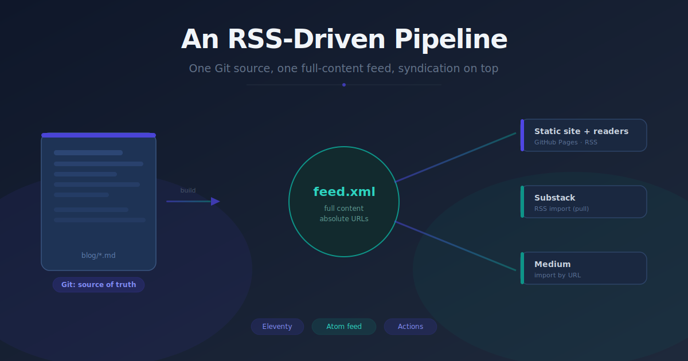
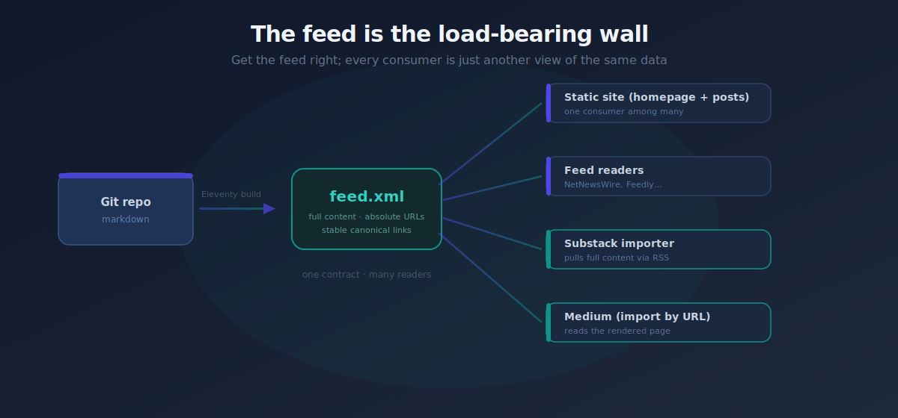
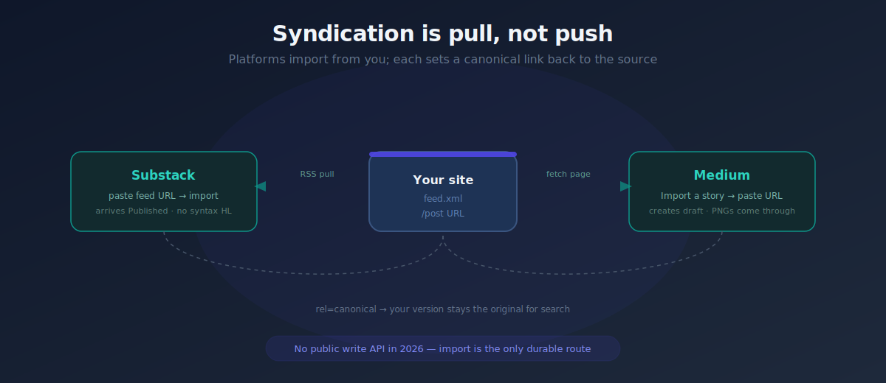

Most "publish everywhere" setups are a pile of brittle integrations that break every time a platform changes its UI. I wanted the opposite: one canonical source, one well-formed feed, and syndication that degrades gracefully instead of silently. This is how that pipeline works, end to end, with the code that matters and the failure modes I hit getting there.

The shape is simple. Markdown lives in a Git repo. A push triggers a build that produces a static site and a full-content `feed.xml`. That feed is the contract — every downstream reader, including Medium and Substack, consumes it. Nothing pushes content out; everything pulls it in. That single inversion is what makes the whole thing robust.

The rest of this post is the *how*: why the feed sits at the center, how the generator is wired, the two image-pipeline bugs that cost me an evening each, the deploy, and the honest state of syndication in 2026.

## Why the feed is the architecture

It's tempting to treat the RSS feed as an afterthought — a file the generator emits and nobody reads. Here it's the load-bearing wall. The site is one consumer of the feed; feed readers are another; Substack's importer is another. If the feed is correct — full content, absolute image URLs, stable canonical links — every consumer works without special-casing. If it's wrong, they all fail in the same way, which makes debugging tractable.

So the design rule is: get the feed right, and treat the rendered HTML pages as just another view of the same data.



That inversion has three concrete consequences worth naming, because they're the reason the rest of the design falls out the way it does:

- **There is exactly one place a post can be wrong.** If an image is broken in the feed, it's broken everywhere — the site, the reader, the import. You never chase a bug that reproduces on Substack but not on your own page, because they read the same bytes. A single artifact to validate is the whole win.
- **Syndication has no write credentials.** Nothing in this pipeline holds an API token for Medium or Substack. There's no secret to rotate, no OAuth scope to renew, no integration to get deprecated out from under you. The platforms reach *in* and read a public URL. That's a smaller attack surface and a smaller maintenance surface at the same time.
- **"Full content" is a hard requirement, not a nicety.** A summary-only feed forces every consumer to crawl back to your site for the body, and importers that don't crawl simply get a truncated post. The feed must carry the entire rendered article, images included, or the contract leaks.

Hold onto that last point — it's the constraint that drives the image pipeline two sections down.

## The generator

I use [Eleventy](https://www.11ty.dev/) because it's Node-based — no separate toolchain to maintain alongside a JS/TS stack, and the RSS plugin is first-party. Posts are markdown in `blog/` with frontmatter that the feed depends on:

```yaml
---
layout: post.njk
title: "An RSS-Driven Publishing Pipeline"
description: "One-sentence summary for the feed and cards."
date: 2026-06-21
tags: posts
---
```

Each field earns its place:

- `title` and `description` become the feed entry's `<title>` and `<summary>`, and they're also what render on the homepage cards. Write the description as a real one-sentence abstract, not SEO filler — it's the first thing a feed-reader subscriber sees.
- `date` drives sort order and the feed's `<updated>` timestamp. Eleventy parses it as a date; if you ever see posts in the wrong order, it's almost always a string date that didn't parse.
- `tags: posts` is the load-bearing one. It's how a post enters the feed collection. **A post missing this line builds a page but never syndicates** — it exists at its URL, but it's invisible to the feed, the homepage list, and therefore every importer. This is the single most common "why didn't my post show up" cause, and because the page itself builds fine, nothing errors. Knowing it up front saves you the confused debugging session.

### Wiring the feed

The feed itself comes from the official plugin, configured for full content and a correct absolute base:

```js
const { feedPlugin } = require("@11ty/eleventy-plugin-rss");

const SITE_URL = (process.env.SITE_URL || "https://example.github.io").replace(/\/$/, "");

module.exports = function (eleventyConfig) {
  eleventyConfig.addPlugin(feedPlugin, {
    type: "atom",
    outputPath: "/feed.xml",
    collection: { name: "posts", limit: 0 }, // 0 = all posts, not just recent N
    metadata: {
      language: "en",
      title: "Engineering Notes",
      base: SITE_URL + "/",            // MUST be absolute — see the URL bug below
      author: { name: "Your Name" },
    },
  });

  eleventyConfig.addCollection("posts", (api) =>
    api.getFilteredByGlob("blog/*.md").sort((a, b) => b.date - a.date)
  );

  return { dir: { input: ".", includes: "_includes", output: "_site" } };
};
```

A few choices here are deliberate:

**`type: "atom"` over RSS 2.0.** Atom is stricter about required fields (every entry needs a stable `id`, an `updated`, and the feed needs an author), and that strictness is a feature when the feed is your contract — the plugin won't let you emit a feed that's missing the fields importers rely on. Both Substack and feed readers accept Atom fine.

**`base` is read from an environment variable, normalized once.** The `.replace(/\/$/, "")` strips a trailing slash so that `SITE_URL + "/"` never produces a double slash. That single line is the difference between `https://site.com//assets/x.png` (which some CDNs 404) and a clean URL. CI sets `SITE_URL`; local builds fall back to the default. Same code path, same output.

**`limit: 0` means the full archive.** Some importers — Substack's included — do a one-pass read of the feed and import whatever items are present at that moment. If you cap the feed at the most recent 10 items, a fresh import silently backfills only those 10 and drops everything older, with no warning. Emitting the entire archive means one import captures the whole history. The cost is a larger `feed.xml`, which is negligible for a text feed even at hundreds of posts.

**The collection is sorted newest-first** so both the feed and the homepage share one ordering. Defining order in exactly one place is the same principle as the feed itself: don't let two consumers disagree about the same data.

## The illustration problem: SVG in, PNG out

Posts are illustrated with hand-authored SVG — scriptable, crisp at any zoom, diff-able in version control, and tiny on disk. For a site I'd happily ship SVG and never think about it again. But the feed changes the calculus, because here's a constraint that bites silently:

**Medium and Substack importers fetch and embed raster images. They do not render SVG.** If the feed references an `.svg`, the importer either drops the image entirely or embeds a broken reference. Every illustration vanishes on import — with no error, no warning, no log line. You find out when you look at the published copy and the article is all text.

So the requirement is contradictory only on the surface: author in SVG (best for editing and for the crisp web experience), but ship raster to anything that imports. The resolution is to generate the PNG at build time and keep the SVG as the source of truth.

### Rasterizing at build time

A build stage walks the assets tree and renders every SVG to a same-named PNG using [sharp](https://sharp.pixelplumbing.com/):

```js
// scripts/build-assets.js
const fs = require("fs");
const path = require("path");
const sharp = require("sharp");

function* walk(dir) {
  for (const e of fs.readdirSync(dir, { withFileTypes: true })) {
    const full = path.join(dir, e.name);
    if (e.isDirectory()) yield* walk(full);
    else if (e.name.toLowerCase().endsWith(".svg")) yield full;
  }
}

(async () => {
  for (const svg of walk(path.join(__dirname, "..", "blog", "assets"))) {
    await sharp(svg, { density: 200 })            // render SVG at 200 DPI, not the default 72
      .resize({ width: 2400, withoutEnlargement: true }) // crisp at 2x on retina, never upscale
      .png()
      .toFile(svg.replace(/\.svg$/i, ".png"));
  }
})();
```

Two parameters here matter more than they look:

- **`density: 200`.** sharp rasterizes SVG through libvips, which defaults to 72 DPI. At 72 DPI a 1200-px-wide SVG renders to a soft, undersized bitmap. Bumping the density tells the rasterizer to sample the vector at a higher resolution before it ever hits the `resize`, so text edges and thin strokes stay sharp. If your PNGs look fuzzy, density is the first knob.
- **`withoutEnlargement: true`.** The `resize` targets 2400px for retina crispness, but this flag means a smaller source SVG is never upscaled into a blurry mess — it just renders at its natural size. You get "at least crisp," never "stretched."

The script is idempotent and cheap: it overwrites the PNGs every build, so the committed SVG is always the source and the PNG is always derived. I commit both (the PNG so the site works even if someone clones and serves `_site` without a build, the SVG because it's the editable original), but the PNG is regenerated on every CI run, so it can never drift from the SVG.

### Rewriting references before render

Generating PNGs isn't enough — the markdown still says `.svg`, and it uses repo-relative paths. A preprocessor fixes both *before* Eleventy renders, so the change flows into the HTML page and the feed body identically:

```js
eleventyConfig.addPreprocessor("imgRefs", "md", (data, content) =>
  content
    .replace(/(\]\()(?:\.\/)?assets\//gi, "$1/assets/")  // 1. root-absolute path
    .replace(/(\]\([^)]+?)\.svg(\))/gi, "$1.png$2")        // 2. swap extension svg -> png
);
```

The order is two independent rewrites on the markdown image syntax ``:

1. **`assets/…` → `/assets/…`** turns a repo-relative path into a root-absolute one. In the repo, images live next to posts under `blog/assets/<slug>/`; on the built site they're copied to `/assets/<slug>/`. Without this rewrite the relative path would resolve against the post's URL and double the directory.
2. **`.svg` → `.png`** points every reference at the rasterized output.

Because this runs as a preprocessor on the raw markdown, the rewritten reference is what gets rendered into *both* outputs. The feed plugin then takes the root-absolute `/assets/…` path and prefixes it with `base` to produce a fully-qualified `https://…/assets/…/x.png` in the feed XML. One set of authored files; two consumers — browser and importer — each served what it can actually use.

A subtle benefit: the regexes only touch markdown image syntax (`](…)`), so a literal `.svg` string inside a fenced code block in your post is left untouched. You can write *about* SVG, showing `.svg` paths in code samples, without the preprocessor mangling your prose.

## The bug worth dwelling on: absolute URLs and subpaths

When I first tested the feed, the image URLs came out mangled in two different ways, and untangling them is the most transferable lesson in this whole setup.

The first symptom was a **doubled path** — URLs like `/assets/<slug>/assets/<slug>/hero.png`. That was the relative-path rewrite missing: a repo-relative `assets/…` reference resolved against the post's own URL, so the directory got concatenated twice. The `assets/ → /assets/` rewrite above fixes it by anchoring to the site root.

The second symptom was nastier because the feed *looked* correct. On a GitHub Pages **project** site — served at `https://<user>.github.io/<repo>/` — root-absolute paths like `/assets/x.png` resolve against the **domain origin**, not the project subpath. So `/assets/x.png` becomes `https://<user>.github.io/assets/x.png`, the `/<repo>` segment silently disappears, and the image 404s. The feed XML was well-formed, the URLs were absolute, everything *read* fine — but every image was quietly broken, and an import would produce text with no pictures and no explanation.

There are two ways out, and only one of them is worth taking:

- **Fight it with `pathPrefix`.** Eleventy has a `pathPrefix` option, and the RSS plugin can incorporate it, so you *can* make a project-subpath site emit correct absolute URLs. But now every link, every asset, every `base` has to thread the prefix correctly, and any helper that builds a URL by hand becomes a place the prefix can be forgotten. You're adding a coordinate to every URL in the system to work around a hosting choice.
- **Serve at a domain root instead.** A `<user>.github.io` repo (the one named exactly after your username) is served at the bare root, and so is any custom domain you attach. At a root, `/assets/x.png` resolves correctly with zero special handling, no `pathPrefix`, no prefix threading. The class of bug simply cannot occur.

This is the single highest-leverage setup decision in the pipeline. If you take one thing from this post: **don't deploy a feed-driven site to a project subpath.** Use a user/org Pages repo or a custom domain, and the entire category of subpath URL bugs evaporates.

A cheap verification step earns a permanent place in your release routine, because it catches this and several other failures at once:

```bash
# After deploy, fetch the feed and pull out every image URL, then check each one.
curl -s https://example.github.io/feed.xml \
  | grep -oE 'https://[^"]+\.png' \
  | sort -u \
  | while read -r url; do
      code=$(curl -s -o /dev/null -w '%{http_code}' "$url")
      echo "$code  $url"
    done
```

Every line should start with `200`. A `404` means an image is broken in the feed — fix it *before* you import anywhere, because once a platform has imported a broken post, you're cleaning it up by hand on their side.

## Deploying with GitHub Actions

The deploy is unremarkable, which is exactly the goal — a boring deploy is one you don't think about. On a push that touches content, build and ship to Pages:

```yaml
name: Publish blog
on:
  push:
    branches: [main]
    paths: ["blog/**", ".eleventy.js", "scripts/**", "_includes/**"]
  workflow_dispatch: {}

permissions: { contents: read, pages: write, id-token: write }
concurrency: { group: pages, cancel-in-progress: false }

jobs:
  build:
    runs-on: ubuntu-latest
    steps:
      - uses: actions/checkout@v4
      - uses: actions/setup-node@v4
        with: { node-version: 22, cache: npm }
      - run: npm ci
      - run: npm run build           # rasterize SVGs, then run Eleventy
        env: { SITE_URL: https://example.github.io }
      - uses: actions/upload-pages-artifact@v3
        with: { path: _site }
  deploy:
    needs: build
    runs-on: ubuntu-latest
    environment: { name: github-pages, url: "${{ steps.deployment.outputs.page_url }}" }
    steps:
      - id: deployment
        uses: actions/deploy-pages@v4
```

The details that make it reliable rather than just functional:

- **`paths:` filters the trigger.** A commit that only touches the README or CI config won't rebuild and redeploy the site. Builds happen when the content or the machinery that shapes it changes, and not otherwise — which keeps the deploy history meaningful and your Actions minutes low.
- **`workflow_dispatch: {}`** adds a manual "Run workflow" button. Useful when you want to force a rebuild without a commit — say, after changing a repository secret or re-checking a deploy.
- **`permissions` are the minimum for Pages.** `contents: read` to check out, `pages: write` to publish, and `id-token: write` for the OIDC token that `deploy-pages` uses to authenticate to the Pages service. No broader scope is granted, so a compromised action can't do more than publish the site.
- **`concurrency` with `cancel-in-progress: false`** serializes deploys on a single `pages` group. Two quick pushes won't race to publish; the second waits for the first. `false` (rather than cancelling the in-flight run) means a deploy already uploading isn't aborted halfway.
- **`SITE_URL` is set as an env var on the build**, which is what feeds the `base` in the Eleventy config. CI and your machine run the *same* `npm run build` — the only difference is this one variable — so a build that works locally works in CI.
- **Two jobs, not one.** `build` produces an artifact; `deploy` consumes it. Splitting them is the GitHub-recommended Pages pattern: the build can't accidentally publish a half-finished `_site`, because publishing is a separate, explicit step gated on the build succeeding.

The `npm run build` script chains `node scripts/build-assets.js && eleventy`. Because rasterization is the first link in that chain, there's no way to build the site without first regenerating the PNGs — CI and local output are byte-identical, and you can't ship a stale image.

## Syndication: the honest version

Here's where expectations need calibrating, because most "auto-post to Medium and Substack" tutorials are describing a world that no longer exists.

**You cannot truly auto-publish to Medium or Substack in 2026.** Medium stopped issuing API integration tokens on 2025-01-01 and archived its API as unsupported; unless you're holding an old token from before that date, there is no programmatic publish path. Substack never had a public write API at all — its only inbound route is an RSS importer, and it's pull-based by design.

So syndication is feed-driven *import*, not push. That sounds like a downgrade, but it's actually what makes the pipeline durable: because the feed is correct, both platforms accept it cleanly, and there's no credential or integration that a platform can deprecate to break you.



### Substack — RSS import

Settings → Import/Export → Import posts → paste the feed URL (`https://example.github.io/feed.xml`). Substack pulls the posts and sets canonical links back to your site, so search engines still credit your copy as the original. Two caveats to plan around:

- **Imported posts arrive as *Published*, not drafts.** There's no "import as draft" option. So import during a quiet window and review immediately — or better, import once, then rely on incremental imports for new posts and check each one promptly. Treat the import as a publish action, because that's what it is.
- **Code blocks lose syntax highlighting.** Substack's editor has no code-highlighting concept, so fenced code comes through as monospaced but uncolored. For a code-heavy post this is cosmetic, not broken — the code is intact and copyable — but it's worth knowing before you're surprised by how a tutorial looks on Substack.

Because the feed carries full content with absolute PNG URLs, the body and images both come through. This is the payoff for the entire image pipeline: the SVG-to-PNG work two sections up is *why* Substack shows your diagrams instead of dropping them.

### Medium — import by URL

Medium has no feed import, but "Import a story" takes a single URL. Paste the post's canonical URL; Medium fetches the rendered page, converts it to a **draft** (note: draft, unlike Substack — you get a review step for free), and sets `rel=canonical` back to your site so search engines treat your version as the original. Because the page serves absolute PNG URLs, the images come through here too — Medium re-hosts them on its own CDN as part of the import.

The canonical link is the quiet hero of this whole arrangement. Both platforms point back to your URL, so you publish the same article in three places without a duplicate-content penalty — Google understands which one is authoritative. Your site stays the source of record even when most of your readers are on someone else's platform.

### The closest thing to automation

If you want hands-off syndication, an IFTTT applet ("new RSS item → Medium") uses Medium's *internal* posting pathway rather than the dead public API. It works, and it'll publish new posts without you touching Medium. But it's fragile — it depends on an internal integration Medium could change without notice — so treat it as a convenience, not a guarantee. Whatever you automate, verify each post actually landed and rendered correctly. The whole point of this architecture is that verification is cheap: open the published copy, confirm the images loaded, done.

## The full loop

End to end, publishing a post looks like this.

**The hands-off half:**

1. Write the markdown in `blog/<slug>.md` with the frontmatter (don't forget `tags: posts`).
2. Drop the SVG illustrations in `blog/assets/<slug>/`.
3. Commit and push to `main`.
4. GitHub Actions rasterizes the SVGs to PNG, runs Eleventy, and deploys to Pages. The homepage updates and `feed.xml` picks up the new post automatically.

**The manual last mile:**

5. Confirm the post is live and run the feed-image check (`curl … | grep … | check 200`) so you *know* the images resolve before any platform reads them.
6. Import / confirm the post on Substack (or let an incremental import pick it up).
7. Import the post URL into Medium, review the draft, publish.

Steps 1–4 are fully automated. Steps 5–7 are a few minutes of clicking and a sanity check. That split is intentional: the parts that *can* be made reliable and unattended are, and the parts that depend on third-party UIs stay manual and verified rather than automated and silently broken.

## What this buys you

It's less magical than "push and it's everywhere," but everything is inspectable and version-controlled, and nothing depends on a credential a platform can revoke. The feed is a real artifact you can open in a browser, validate with a feed checker, and reason about. The canonical source is yours, on infrastructure you control, and the syndicated copies all point back to it with `rel=canonical`.

The durability is the entire point. When a platform changes its import UI — and they will — nothing in your pipeline breaks; you just click a slightly different button next time. There's no token to expire, no webhook to re-register, no integration to migrate. You moved the complexity from N fragile push-integrations to one correct artifact that everything pulls from, and a correct artifact is a thing you can actually keep correct.

That's the trade: a few minutes of manual import per post, in exchange for a publishing system that doesn't rot. For a blog you intend to keep for years, that's the right side of the bargain.
